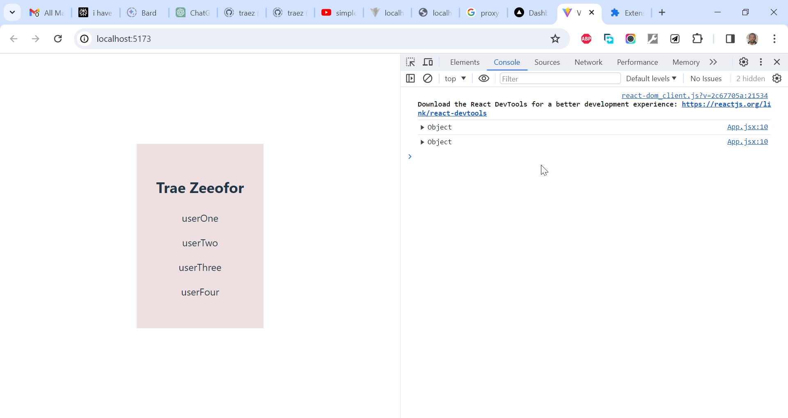

# Arpan Neupane - Express/Node + React Project

This is a solution to the [Arpan Neupane's Express/Node + React Project project](https://www.youtube.com/watch?v=w3vs4a03y3I). I'm testing my hand creating very simple projects for now to get familiar with the matter. 

## Table of contents

- [Overview](#overview)
  - [The challenge](#the-challenge)
  - [Screenshot](#screenshot)
  - [Links](#links)
  - [My process](#my-process)
  - [Built with](#built-with)
  - [What I learned](#what-i-learned)
  - [Continued development](#continued-development)
  - [Useful resources](#useful-resources)
  - [Author](#author)
  - [Acknowledgments](#acknowledgments)

## Overview

### The Challenge/User Stories

Create a project with an Express/Node backend and a React frontend. We will set up a backend API with Express that returns an array of users and in the frontend, we will fetch that backend and display the same users onto the frontend.

### Screenshot

### Links

- Solution URL: [https://github.com/traez/express-node-react-project2](https://github.com/traez/express-node-react-project2)
- Live Site URL: [https://express-node-react-project2-traez.vercel.app](https://express-node-react-project2-traez.vercel.app)

## My process

### Built with

- Semantic HTML5 markup
- CSS custom properties
- Flexbox
- CSS Grid (No)
- Mobile-first workflow
- [React](https://reactjs.org/) - JS library (No)
- [Next.js](https://nextjs.org/) - React framework (No)
- Tailwind CSS (No)
- Typescript (No)
- Nodejs
- Expressjs

### What I learned

- Node.js and Express.js backend with React frontend.
- My first time doing a React project with Vite as against CRA.

### Continued development

- More increasingly complex MERN stack projects. 

### Useful resources

Stackoverflow  
YouTube  
Google  
ChatGPT

## Author

- Website - [Trae Zeeofor](https://github.com/traez)
- Twitter - [@trae_z](https://twitter.com/trae_z)

## Acknowledgments

To all MERN stack Developers and Content Creators. Well done!.
